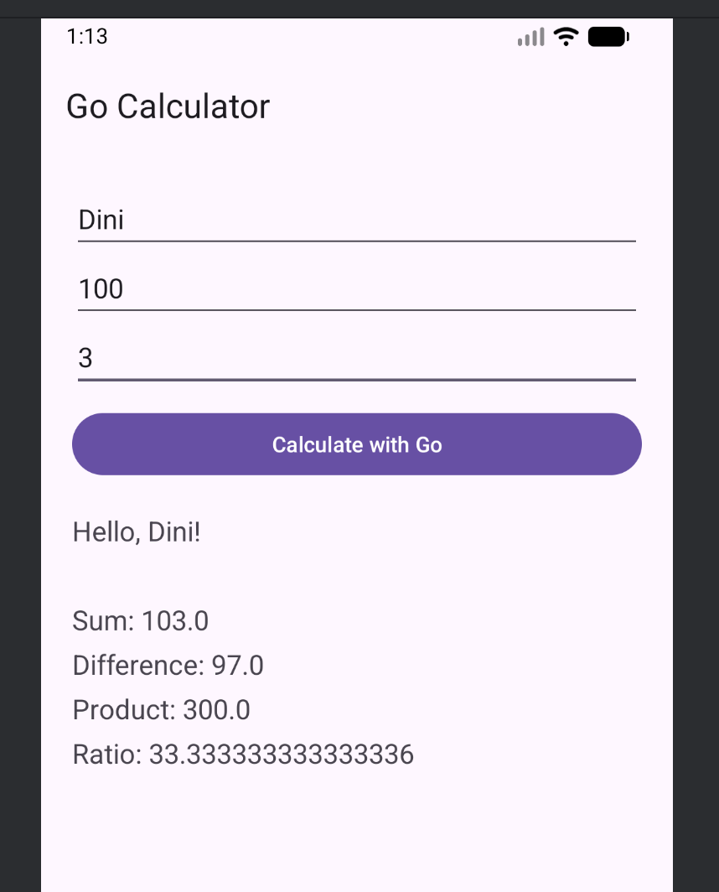
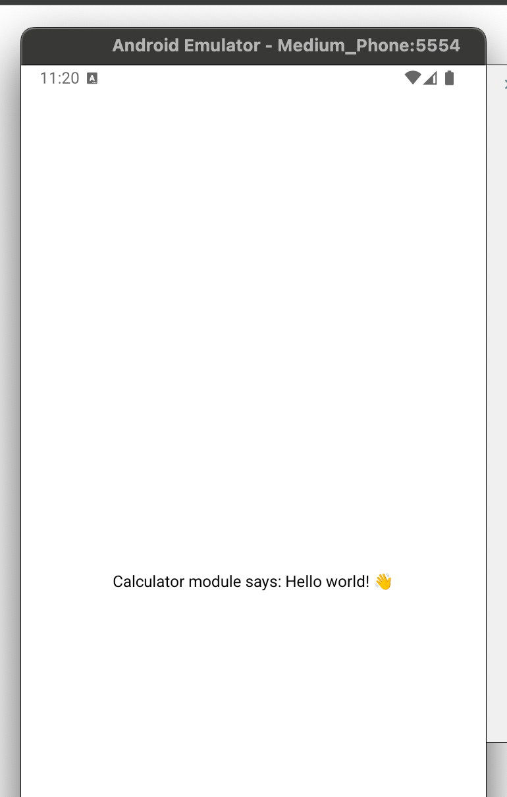

# GoReactPoc

The repository is about to run go code on mobile.

## More detailed plan

- compile Golang package with gomobile
- embed this output into an Android / iOS app mainly with React Native
  - first go is with Android because it is simpler

## Part I. Implementation Java for Android

1. Install golang. Recommended to use goenv.
2. Install JDK (required by gomobile as well) - version 17 will do it for not. Recommend to use some tool - I have used SDKMAN for it.
3. Install Android Studio for easy SDK/NDK management. Android 16 - Api 36 installed with NDK 29.0.14206865
4. Here are some of my configured env vars maybe it helps you

   ```bash
   GOROOT=/Users/YOUR_USERNAME/.goenv/versions/1.24.2
   GOPATH=/Users/YOUR_USERNAME/go/1.24.2
   ANDROID_HOME=/Users/YOUR_USERNAME/Library/Android/sdk
   ANDROID_NDK_HOME=/Users/YOUR_USERNAME/Library/Android/sdk/ndk/29.0.14206865
   SDKMAN_DIR=/Users/YOUR_USERNAME/.sdkman
   SDKMAN_CANDIDATES_API=https://api.sdkman.io/2
   SDKMAN_BROKER_API=https://broker.sdkman.io
   SDKMAN_PLATFORM=darwinarm64
   SDKMAN_CANDIDATES_DIR=/Users/YOUR_USERNAME/.sdkman/candidates
   binary_input=/Users/YOUR_USERNAME/.sdkman/tmp/java-17.0.12-tem.bin
   ```

5. You maybe need to run `go install golang.org/x/mobile/cmd/gomobile@latest` check it by execute `gomoblie` command in the terminal
6. Run `make install` in project root
7. Run `make pre-build-java` in project root - or check the Makefile if you want to do things manually - what this does is:
   1. use gomobile to compile go code
   2. copy the binary where the GoInJava app expects it to be
8. GoInJava project is in Android Studio
   1. To build the project run `make build-java-android` or `./gradlew` in the GoInJava folder
   2. It uses Gradle and every time you update the \*.aar file you have to run a build otherwise it does not detect the changes
9. Start an emulator in Android Studio and load the app there and you can try



## Part II. Implementation with React Native

1. Create new Expo app for react native - select Blank (TypeScript). `npx create-expo-app --template` I named it GoInReact.
2. Now a Kotlin/Java wrapper required. cd GoInReact and create expo module `npx create-expo-module@latest --local`. I used the following namings.
   ✔ What is the name of the local module? … calculator
   ✔ What is the native module name? … Calculator
   ✔ What is the Android package name? … expo.module.gocalculator
3. That command created a structure under module and the CalculatorModule class.
   This class should be implemented for each platform and in this layer the golang lib call can be achieved.
4. For testing run npm start which will open App.tsx. This React Component calls out for the module created above and the underlying implementation will be called depending on the platform:
   1. Web = CalculatorModule.web.ts
   2. Android = CalculatorModule.kt
   3. iOS = CalculatorModule.swift
5. After the module created have to build the whole together with Gradle otherwise **it will not work** . Use the following command: `npx expo prebuild --clean --platform android`
6. Execute `npm run android` in GoInReact folder and it should result like this:



### Part II.A Implementing to Android emulator - with Kotlin wrapper

1. Build Go module and copy the poc.aar file under ./modules/calculator/android/src/libs (run `make pre-build-react-android` in the root directory)
2. Add the source above to the Gradle build file at ./modules/calculator/android/build.gradle

   ```gradle
      dependencies {
            implementation(name: 'poc', ext: 'aar')
      }
   ```

3. **WARNING** this is a tricky part because this folder is not in repo! It is created by the command at section II/5 . So now need to change the the prebuild Gradle config and rerun it to make things **work**

   1. Go to android/build.gradle and add this to repositories section like this

      ```gradle
      allprojects {
         repositories {
            ... // Leave everything you jave as-is, but add the following:
            flatDir { dirs "$rootDir/../modules/golang-calculator/android/src/libs" }
         }
      }
      ```

   2. now run `make build-react-android` in root folder

4. Now check that things are still fine rerun `npm run android` in GoInReact folder and things still should work.
5. Now to do some useful things open CalculatorModule.kt and add some code.

   > It is important to reference your go **package name** (what you used in main.go) - this is some kind of convention. In our case it will be 'calculator'.

   ```kotlin
      import calculator.Calculator as goCalculator // check your go files package name

     Function("hello") {
      var sum = goCalculator.add(3.0, 5.0)

      "3+5 is $sum (calculated by go calculator)!"
    }
   ```

6.Now run `npm run android` and the result should look like this:


TODO try to parametrize the calls for calculator

### Part II.B Implementing for iOS emulator

TODO
